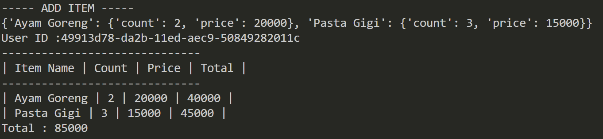
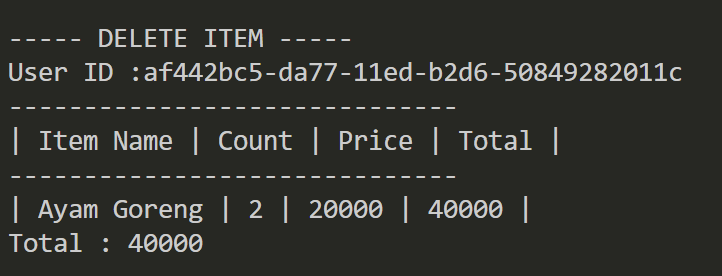
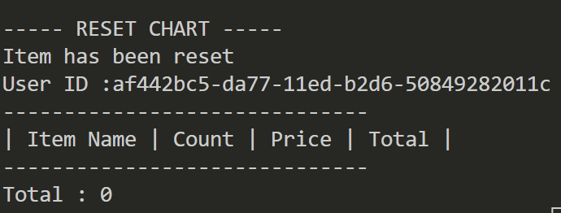
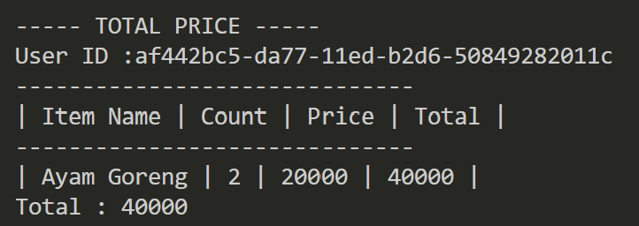
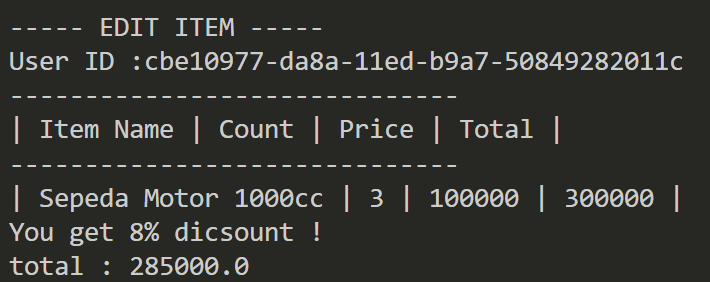

# Pacmann-SuperStoreApp

Repo ini dibangun sebagai tugas akhir materi python pacmann.

## Latar Belakang
Dibutuhkan suatu sistem self service untuk cashier yang dimana sistem dapat melakukan aktifitas CRUD dengan melibatkan customer sebagai aktor dari sistemnya, bukan petugas
kasir. Adapun aktifitas sistem sebagai berikut
 - menginputkan / memasukan barang kedalam keranjang
 - mengubah detail barang
 - menghapus barang
 - melihat isi keranjang
 - mereset isi keranjang

## Requirenments
Untuk menunjang terbentuknya aplikasi self service cashier ini, dibutuhkan suatu alur dari setiap aktifitas yang telah dibuat hingga menjadi seperti dibawah
 - Pembuatan ID
 
    ID diperuntukan sebagai identitas keranjang yang dimiliki oleh setiap customer. ID dibuat menggunakan bantuan ```UUID``` yang dimana ID diperoleh secara otomatis ketika program dijalankan. Selengkapnya dijelaskan pada diagram alur dibawah.

    
 
 - Menambahkan Barang

    Customer diperbolehkan untuk menambahkan barang seusai yang mereka inginkan serta sebanyak apapun yang mereka mau. Aktifitas ini terdapat pada fungsi ```add_items```. Fungsi tersebut membutuhkan satu parameter yaitu ```item_list``` yang berisi item apa yang diinputkan oleh customer dan dikemas dalam bentuk dictionary yang dikemas lagi kedalam list. Selengkapnya dijelaskan pada diagram alur dibawah.
    

 - Mengubah detail barang
  
    Customer diperbolehkan untuk mengubah isi keranjang yang dimiliki. Aktifitas ini terdapat pada fungsi ```edit_item```. Fungsi tersebut membutuhkan beberapa parameter seperti
    - ```name``` : nama barang yang akan di update
    - ```item``` : nama baru untuk item yang dipilih. parameter boleh tidak diisi / default ```False```
    - ```count``` : nilai baru untuk jumlah barang. parameter boleh tidak diisi / default ```False```
    - ```price``` : nilai baru untuk harga barang. parameter boleh tidak diisi / default ```False```
    
    ```name``` diperlukan sistem untuk memperoleh item mana yang akan di ubah. Sistem akan mencari terlebih dahulu apakah item yang diinginkan tersedia didalam keranjang atau tidak. 
    Selain paramater itu jika parameter terisi makan sistem akan mengindikasikan bagian mana yang akan diubah dari barang tersebut. Selengkapnya dijelaskan pada diagram alur dibawah.
    

 - Menghapus Barang
  
    Customer diperbolehkan untuk menghapus barang yang dimiliki didalam keranjang. Aktifitas ini terdapat pada fungsi ```delete_item```. Fungsi tersebut membutuhkan satu parameter yaitu ```item``` yang berisi item apa yang akan dihapus oleh customer. Sistem akan mencari terlebih dahulu apakah item yang diinginkan tersedia didalam keranjang atau tidak.
    Selengkapnya dijelaskan pada diagram alur dibawah.
    

 - Reset Keranjang

    Customer diperbolehkan untuk menghapus barang yang dimiliki didalam keranjang dengan menggunakan fungsi ```reset_item```. Fungsi ini akan menghapus semua isi keranjang.

 - Total Harga
 
    Aktifitas ini secara otomatis dilakukan ketika ada suatu aktifitas yang melibatkan keranjang. Setelah customer melakukan satu aktifitas seperti menambah, mengurangi, atau mengubah, total harga akan otomatis berubah sesuai dengan aktifitas yang terjadi terhadap barang atau nilai barang di dalam keranjang. Aktifitas ini dilakukan didalam fungsi ```total_price```.

  - Menampilkan Barang
  
    Sama seperti ```total harga``` , aktifitas ini dilakukan ketika customer melakukan aktifitas seperti menambah, mengurangi, atau mengubah barang di keranjang. Fungsi ```show_cart``` akan dilakukan sesudah aktifitas sebelumnya dilakukan dengan menampilkan daftar barang didalam keranjang customer.

Semua fungsi yang dijelaskan pada aktifitas diatas dikemas pada satu class bernama ```Transactions``` dengan cara pengaksesan seperti ```transaction = Transactions()```. Dengan begitu ID customer akan langsung tergenerate. Penjelasan detail mengenai setiap fungsi dapat dilihat pada ```transaction.py```.
```
class Transactions:
    
    def __init__(self) -> None:
        self.id = uuid.uuid1()
        self.items = {}

    def show_cart(self) -> None:
        """
        Show list of cart.
        """
        # print(self.items.keys())
        print(f"User ID :{self.id}")
        print("-"*30)
        print("|", "Item Name", "|", "Count", "|", "Price", "|", "Total", "|")
        print("-"*30)
        for key,val in self.items.items():
            print("|",key, "|", val["count"], "|", val["price"], "|", val["count"]*val["price"], "|")

        self.total_price()

    def add_items(self, items:list) -> None:
        """
        This function is made for adding item to cart list

        items: list
            list of items that will buy by user
        """
        try:
            for item in items:
                for key,val in item.items():
                        self.items[key] = val
        except:
            raise

        print(self.items)
        self.show_cart()

    def edit_item(self, name:str, item:str=None, count:int=None, price:int=None) -> None:
        """
        This function is made for editing item list in cart by keys.

        name: str
            the name of key in list
        item: str
            the name for replacing keys or item name
        count: int
            value that will replace 'count' key value
        price: int
            value that will replace 'price' key value
        """
        try:
            if item is not None and type(item) == str:
                self.items[item] = self.items.pop(name)
            else:
                raise Exception(f"key {item} is not str")

            if count is not None and type(count) == int:
                self.items[item]["count"] = count
            else:
                raise Exception(f"key {count} is not int")

            if price is not None and type(price) == int:
                self.items[item]["price"] = price
            else:
                raise Exception(f"key {price} is not int")

            
        except KeyError:
            raise Exception(f"key {name} not found")
            
        
        self.show_cart()

    def delete_item(self, item:str):
        """
        This function is made for deleteing item in list of cart by inputing name of item and pop it.

        item: str
            value that will delete key / item name.
        """
        
        list_cart = list(self.items.keys())
        try:
            self.items.pop(item)
        except:
            raise Exception('Item is not in list.')
        self.show_cart()
        
    def reset_cart(self) -> None:
        """
        This function is made for reseting list of cart that user just add. Clear all the item inside 'self.items'.
        """
        self.items = {}
        print("Item has been reset")
        self.show_cart()

    def total_price(self) -> None:
        """
        This function is made for calculate the price total of cart
        
        var
        ----
        total_price -> will show the total of price
        """


        total_price = []
        list_cart = list(self.items.keys())
        
        for item in list_cart:
            total_price.append(self.items[item]["count"]*self.items[item]["price"])

        if sum(total_price) > 500000:
            print(f"You get 10% dicsount !\nTotal : {sum(total_price) - (0.1 * sum(total_price))}")
        elif sum(total_price) > 300000:
            print(f"You get 8% dicsount !\ntotal : {sum(total_price) - (0.08 * sum(total_price))}")
        elif sum(total_price) > 200000:
            print(f"You get 8% dicsount !\ntotal : {sum(total_price) - (0.05 * sum(total_price))}")
        else:
            print(f"Total : {sum(total_price)}")

    def check_list_item(self, item_name):
```

## Penggunaan
Sistem ini digunakan dengan menjalankan program pada `main.py`. Customer akan ditanyai terkait opsi yang akan customer inginkan seperti 
- barang apa yang ingin ditambahkan ?
- berapa jumlahnya ?
- berapa harganya ?
- apa yang ingin dilakukan setelahnya ?
  - ```what you want to do next ?
            [1] edit item
            [2] delete item
            [3] reset chart  
            [4] finish
    ``` 

Semua jawaban akan dikemas dalam satu variable yang disesuaikan dengan inputan pada masing masing method yang digunakan pada class `transactions`. Sitem mencoba memberikan pendekatan yang lebih personal layaknya seperti melakukan proses beli di toko. 
  
## Test Case
Ada beberapa test case yang dilakukan untuk menguji sistem yang dijabarkan dibawah : 
- Customer ingin menambahkan 2 item baru dengan method ```add_item()```. Berikut hasil yang didapatkan

- Customer salah membeli salah satu item dari belanjaan yang sudah ditambahkan. maka customer menggunakan method ```delete_item()``` untuk menghapus item.

- Menghapus semua item didalam keranjang menggunakan method `reset_cart`

- Menghitung total belanja menggunakan method `total_price()`
 
- Mengubah Nilai ayam goreng menjadi sepeda motor dengan count sebanyak 3 dan harga 100000


## Conclusion
Sistem self service cashier superstore-App ini berjalan sesuai latar belakang masalah dan requirements yang dibutuhkan. Pada test case yang dilakukan dapat dilihat kalau sistem sudah dapat menjalankan program sesuai yang diinginkan. 